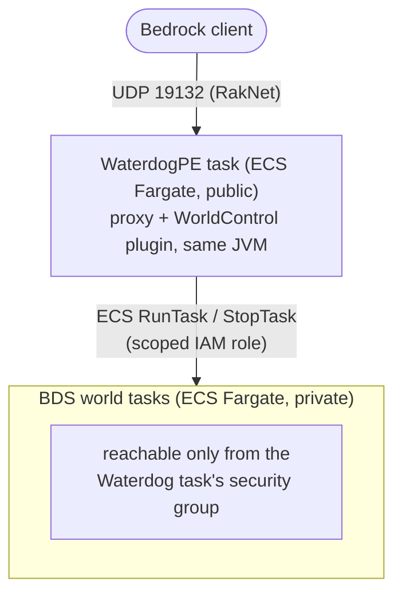
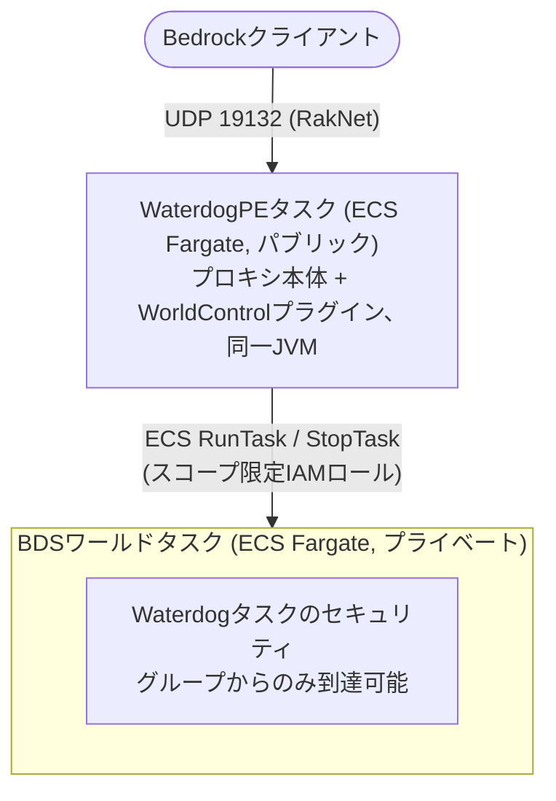

# BDS-waterdogpe

*[English](#english) / [日本語](#japanese)*

<a id="english"></a>
## English

A PMMP-style dynamic multi-world setup for vanilla Minecraft Bedrock
Dedicated Server (BDS), built on [WaterdogPE](https://github.com/WaterdogPE/WaterdogPE)
and AWS ECS Fargate. Players connect to a single WaterdogPE proxy; worlds
are provisioned/torn down on demand as separate BDS tasks, without ever
restarting the proxy.

### Why

BDS has no built-in concept of multiple loaded worlds or a plugin API -
each world is a separate server process. WaterdogPE fills the "multiple
worlds behind one address" role that a plugin-extensible server (like
PMMP) gets for free, and its plugin API can register/unregister
downstream servers at runtime. This repo wires that up to ECS Fargate so
a whole world - provisioning the task, waiting for it to become healthy,
registering it with the proxy - happens behind a single API call.

### Architecture



Nothing calls back into BDS: the Bedrock Dedicated Server binary has no
plugin system, so "add a world" can only ever be triggered from outside
it (the WorldControl API, or hakomc scripts calling that API from
inside a *different* running world - see below).

### Layout

- **`waterdog/`** - the WaterdogPE proxy image and the `WorldControl`
  plugin (Java/Gradle) that provisions worlds, via either the AWS SDK
  or the `docker` CLI depending on the `PROVISIONER` env var (`ecs` or
  `docker` - see `WorldProvisioner`/`EcsWorldProvisioner`/
  `DockerWorldProvisioner` in
  [`waterdog/plugin/src`](waterdog/plugin/src)). `waterdog/config.yml`
  is the ECS target's proxy config, with `lobby` as a static entry
  (it's co-located in Waterdog's own task there - see
  [Deploying (ECS Fargate)](#deploying-ecs-fargate)); the Docker
  Compose target uses its own copy, `docker/config.yml`, with no
  static servers at all - see the `docker/` entry below.
- **`infra/`** - AWS CDK (TypeScript) stack, one deployment target
  (`PROVISIONER=ecs`): VPC (public subnets only, no NAT Gateway -
  there's no load balancer or multi-instance HA in scope, so it isn't
  needed), security groups, the ECS cluster/task definitions, and the
  IAM policy that scopes WorldControl's AWS access to
  `RunTask`/`StopTask`/`DescribeTasks` on this cluster and `PassRole`
  on exactly the BDS task's two roles. Worlds added here don't survive
  a Waterdog task replacement - there's no reconcile-on-boot for this
  target yet (see the Docker target below).
- **`docker/`** - Docker Compose, the other deployment target
  (`PROVISIONER=docker`): a single `waterdogpe` service, with the
  host's Docker socket mounted into the Waterdog container so it can
  `docker run` new world containers directly - `lobby` included, it's
  provisioned the same way as any other world at startup rather than
  being its own Compose service. That grants whoever can reach the
  WorldControl API full control of the host's Docker daemon - there's
  no IAM-style scoping possible for a Docker socket, so this trades
  the ECS path's least-privilege IAM policy for not having to build
  and run a separate provisioning service. Keep `:8081`
  loopback-only (see `docker/docker-compose.yml`), same reasoning as
  the ECS path's dedicated control security group. Worlds added via
  `POST /worlds` persist across restarts (container data under
  `docker/data/`, a small state file under `docker/data/state/` - see
  [Persistence and reconciliation](#persistence-and-reconciliation));
  `docker/shared/` optionally distributes the same behavior
  packs/config to every world, lobby included - see
  [Shared behavior packs and config](#shared-behavior-packs-and-config).
- **the repo root** (`package.json`, `src/`, `worlds/`, ...) - a
  [hakomc](https://github.com/hakomc/hakomc) dev environment (Bedrock
  Scripting API), bootstrapped from
  [hakomc-server](https://github.com/hakomc/hakomc-server).
  `src/worldControl.ts` is a small client for the WorldControl API so
  a behavior pack running on *one* world can add or remove *other*
  worlds, using `@minecraft/server-net`'s HTTP client (the only way to
  make outbound HTTP calls from BDS-side scripts).
  [`examples/worldControlCommands`](examples/worldControlCommands) is a
  standalone hakomc project (its own `docker compose up`-able dev
  server) that depends on `hakomc-world` via the git URL above and
  wires it up to in-game slash commands
  (`/hakomc:worldadd`/`worldstop`/`worldremove`/`worldlist`/`worldtransfer`).

### Usage

Once deployed, everything goes through the WorldControl API on the
Waterdog task (`<waterdog-ip>:8081` - VPC-internal only, see
[Architecture](#architecture)). Two ways to call it:

**Directly**, e.g. from something with network access to that VPC:

```bash
curl -X POST http://<waterdog-ip>:8081/worlds -d "name=survival2&gamemode=survival&worldType=normal"
curl http://<waterdog-ip>:8081/worlds
curl -X POST http://<waterdog-ip>:8081/worlds/survival2/stop
curl -X DELETE http://<waterdog-ip>:8081/worlds/survival2
curl -X POST http://<waterdog-ip>:8081/players/Steve/transfer -d "world=survival2"
```

**From a BDS-side script**, using this repo's `worldControl.ts`
(bundled as the `hakomc-world` package). Install it straight from this
repo:

```bash
npm install git+https://github.com/gollilla/MultiWorldBDS.git
```

```ts
import { addWorld, stopWorld, removeWorld, listWorlds, transferPlayer } from 'hakomc-world';

await addWorld('survival2', 'survival', 'normal');
console.log(await listWorlds());
await transferPlayer('Steve', 'survival2'); // Steve must already be on this proxy
await stopWorld('survival2');   // pauses it, data kept - addWorld resumes it later
await removeWorld('survival2'); // stops it AND erases its data for good
```

This lets a behavior pack running on one world add or remove *other*
worlds - e.g. a hub world with a "create world" command. The base URL
is read from this server's `variables` config as `worldControlApiUrl`
(see the comment in `src/worldControl.ts`).

`POST /worlds` takes:

- `name` (required)
- `gamemode` (optional, default `survival`)
- `worldType` (optional, default `normal`): `normal` for a regular
  generated world, `flat` for BDS's flat preset, or `void` for a
  pre-built empty world - **Docker target only**, see
  [Deploying (Docker Compose)](#deploying-docker-compose); requesting
  `void` against the ECS target fails with a 502.

`POST /worlds/{name}/stop` vs `DELETE /worlds/{name}`: both unregister
the world from Waterdog and stop its backend (ECS task/Docker
container), but only `DELETE` erases its data. Calling `POST /worlds`
again for a name that was `stop`'d resumes it against its existing
world data instead of generating a new one (so `worldType` is only
honored the first time a name is ever created).

`POST /players/{name}/transfer` moves an already-connected player to a
world registered with Waterdog (form field: `world`) - the same fast
transfer the built-in `/server <name>` command triggers, just callable
from outside the player's own session (e.g. a hub world's "join my
friend" button, or a matchmaking script deciding where a player
belongs). The player must already be connected to this Waterdog
instance; 404 if either the player or the world isn't found.

### Building

```bash
# WaterdogPE + plugin image (multi-stage: builds the plugin jar, then
# assembles the proxy image)
docker build -t waterdogpe ./waterdog

# CDK infra - type-checks and synthesizes CloudFormation templates,
# does not deploy anything
cd infra && npm install && npx cdk synth

# hakomc dev environment + WorldControl operations library (repo root)
npm install && npm run build
```

### Deploying (ECS Fargate)

Prerequisites: AWS credentials with permission to create the resources
in `infra/lib` (VPC, ECS, IAM roles, security groups, log groups), a
region set (`aws configure` default, `--profile`, or `CDK_DEFAULT_REGION`),
and Docker running locally (the Waterdog image is built from source at
deploy time). **This creates real, billed AWS resources.**

```bash
cd infra
npm install

# One-time per AWS account + region
npx cdk bootstrap

npx cdk deploy --all
```

`cdk deploy` prints `ClusterName` and `ServiceName` outputs. There's no
load balancer, so the Waterdog task's public IP isn't fixed - it's
reassigned if the task is ever replaced - use the outputs to look up
the current one:

```bash
TASK_ARN=$(aws ecs list-tasks --cluster <ClusterName> --service-name <ServiceName> --query 'taskArns[0]' --output text)
ENI_ID=$(aws ecs describe-tasks --cluster <ClusterName> --tasks "$TASK_ARN" --query 'tasks[0].attachments[0].details[?name==`networkInterfaceId`].value' --output text)
aws ec2 describe-network-interfaces --network-interface-ids "$ENI_ID" --query 'NetworkInterfaces[0].Association.PublicIp' --output text
```

To tear everything down (stops billing; any BDS worlds started via
`addWorld`/`POST /worlds` also need to be stopped first, since they're
separate ad-hoc tasks the stacks don't track):

```bash
npx cdk destroy --all
```

### Deploying (Docker Compose)

The self-hosted alternative - no AWS account needed. Mounts the host's
Docker socket into the Waterdog container (see the `docker/` note in
[Layout](#layout) for the tradeoff that implies).

```bash
cd docker
docker compose up -d --build
```

Connect to this host on UDP 19132; `lobby` is provisioned automatically
on startup, the same way as any other world. Add/remove more the same
way as [Usage](#usage) describes, against `http://127.0.0.1:8081`.

```bash
docker compose down   # world data under docker/data/ is kept
```

#### Persistence and reconciliation

Every world provisioned via `POST /worlds` (`lobby` included) is
tracked in a small state file under `docker/data/state/`. On startup,
`waterdogpe` re-registers every world still known there against its
existing container (`docker start` if the container survived, a fresh
`docker run` reusing its data volume if it didn't - e.g. after a host
reboot). Set `RECONCILE=false` (in `docker/docker-compose.yml` or the
environment) to skip this and leave previously added worlds stopped
until `POST /worlds` is called for them again; `lobby` always starts
regardless of this setting.

#### Shared behavior packs and config

`docker/shared/` is optionally mounted into every world this target
provisions, lobby included:

- `docker/shared/behavior_packs/<pack-name>/` - one subdirectory per
  pack, mounted read-only at `/data/behavior_packs/<pack-name>` in
  every world. Mounted per-pack rather than as one `behavior_packs`
  directory - BDS crashes outright if the whole directory is a mount
  point (its own first-boot extraction of the vanilla pack into that
  same directory doesn't survive being on a different filesystem).
- `docker/shared/world_behavior_packs.json` - hand-maintained (there's
  no JSON parsing anywhere in this plugin), bind-mounted read-only as
  each world's own `world_behavior_packs.json` so BDS actually
  activates the packs above.
- `docker/shared/config/` - mounted read-write at `/data/config` in
  every world (e.g. `config/default/permissions.json`).

Leave `DOCKER_SHARED_DIR` unset in `docker/docker-compose.yml` to skip
all of this. `docker/world-templates/void/` is a separate, unrelated
mount: a single pre-built empty world, `docker cp`'d into place the
first time a `worldType=void` world is created (BDS has no built-in
way to generate one) - replace its contents with your own template if
you want a different starting point for void worlds.

---

<a id="japanese"></a>
## 日本語

素のMinecraft Bedrock Dedicated Server(BDS)上で、PMMPのような動的マルチワールドを実現する仕組み。[WaterdogPE](https://github.com/WaterdogPE/WaterdogPE)とAWS ECS Fargateの上に構築している。プレイヤーは単一のWaterdogPEプロキシに接続し、ワールドは必要に応じて個別のBDSタスクとしてプロビジョニング/破棄される。プロキシを再起動する必要は一切ない。

### なぜこの構成か

BDSには複数ワールドを同時にロードする概念もプラグインAPIも無く、ワールドごとに完全に別のサーバープロセスになる。WaterdogPEは、PMMPのようなプラグイン拡張可能なサーバーが標準で持っている「1つのアドレスの裏に複数ワールド」という役割を肩代わりし、そのプラグインAPIで実行中にダウンストリームサーバーを登録・解除できる。このリポジトリでは、それをECS Fargateに接続し、「タスクをプロビジョニングし、ヘルスチェックが通るのを待ち、プロキシに登録する」という一連の作業をAPI呼び出し1回で完結させている。

### アーキテクチャ



BDS側からの呼び返しは一切無い。Bedrock Dedicated Serverバイナリにはプラグイン機構が無いため、「ワールドを追加する」というトリガーは常に外側(WorldControl API、またはhakomcのスクリプトが*別の*稼働中ワールドからそのAPIを呼ぶ形。後述)からしか発生し得ない。

### 構成

- **`waterdog/`** — WaterdogPEプロキシのイメージと、`PROVISIONER`環境変数(`ecs`または`docker`)に応じてAWS SDKまたは`docker` CLIでワールドをプロビジョニングする`WorldControl`プラグイン(Java/Gradle。[`waterdog/plugin/src`](waterdog/plugin/src)の`WorldProvisioner`/`EcsWorldProvisioner`/`DockerWorldProvisioner`を参照)。`waterdog/config.yml`はECSデプロイ先のプロキシ設定で、`lobby`を静的エントリとして持つ(そちらではWaterdog自身のタスクに同居している。[デプロイ (ECS Fargate)](#デプロイ-ecs-fargate)参照)。Docker Composeデプロイ先は別コピーの`docker/config.yml`を使い、静的サーバーは一切持たない — 下の`docker/`の項を参照。
- **`infra/`** — AWS CDK(TypeScript)スタック、デプロイ先の1つ(`PROVISIONER=ecs`)。VPC(パブリックサブネットのみ、NAT Gateway無し — ロードバランサや複数インスタンスによる高可用性はスコープ外なので不要)、セキュリティグループ、ECSクラスター/タスク定義、そしてWorldControlのAWS操作権限をこのクラスターへの`RunTask`/`StopTask`/`DescribeTasks`と、BDSタスクの2つのロールへの`PassRole`だけに絞ったIAMポリシー。ここで追加したワールドはWaterdogタスクが置き換わると失われる — このデプロイ先にはまだ再起動時の復元(reconcile)機構が無い(下のDocker側を参照)。
- **`docker/`** — Docker Compose、もう1つのデプロイ先(`PROVISIONER=docker`)。単一の`waterdogpe`サービスのみで、Waterdogコンテナにホストのdockerソケットを直接マウントして新しいワールドコンテナを`docker run`できるようにしている — `lobby`もその一つで、専用のComposeサービスではなく、起動時に他のワールドと同じ経路でプロビジョニングされる。これは、WorldControl APIに到達できる者にホストのDockerデーモンの全権限を渡すことを意味する — DockerソケットにはIAMのような権限の絞り込みができないので、専用のプロビジョニングサービスを別途構築・運用しない代わりに、ECS版の最小権限IAMポリシーというメリットを手放すトレードオフ。`:8081`はloopback限定のままにしておくこと([`docker/docker-compose.yml`](docker/docker-compose.yml)参照。理由はECS版の専用制御セキュリティグループと同じ)。`POST /worlds`で追加したワールドは再起動を跨いで残る(コンテナデータは`docker/data/`配下、状態ファイルは`docker/data/state/`配下 — [永続化と復元(reconcile)](#永続化と復元reconcile)参照)。`docker/shared/`では、任意でlobbyを含む全ワールドに同じビヘイビアパック/configを配布できる — [共有ビヘイビアパックとconfig](#共有ビヘイビアパックとconfig)参照。
- **リポジトリのルート**(`package.json`、`src/`、`worlds/`など) — [hakomc](https://github.com/hakomc/hakomc)(Bedrock Scripting API)の開発環境。[hakomc-server](https://github.com/hakomc/hakomc-server)からブートストラップ。`src/worldControl.ts`はWorldControl APIの小さなクライアントで、*あるワールド*上で動いているビヘイビアパックから、`@minecraft/server-net`のHTTPクライアント(BDS側スクリプトから外部HTTP呼び出しを行う唯一の手段)経由で*別のワールド*を追加・削除できる。[`examples/worldControlCommands`](examples/worldControlCommands)は、`hakomc-world`を上記のgit URL経由で依存として持つ、独立したhakomcプロジェクト(それ自体`docker compose up`できるdevサーバー)で、ゲーム内スラッシュコマンド(`/hakomc:worldadd`/`worldstop`/`worldremove`/`worldlist`/`worldtransfer`)に繋いでいる。

### 使い方

デプロイ後は、すべてWaterdogタスク上のWorldControl API(`<waterdogのIP>:8081`、VPC内部のみ。[アーキテクチャ](#アーキテクチャ)参照)経由で操作する。呼び方は2通り。

**直接叩く**(そのVPCにネットワーク到達できる場所から):

```bash
curl -X POST http://<waterdogのIP>:8081/worlds -d "name=survival2&gamemode=survival&worldType=normal"
curl http://<waterdogのIP>:8081/worlds
curl -X POST http://<waterdogのIP>:8081/worlds/survival2/stop
curl -X DELETE http://<waterdogのIP>:8081/worlds/survival2
curl -X POST http://<waterdogのIP>:8081/players/Steve/transfer -d "world=survival2"
```

**BDS側のスクリプトから**、このリポジトリの`worldControl.ts`(`hakomc-world`パッケージとしてバンドルされている)を使う場合。このリポジトリから直接インストールできる:

```bash
npm install git+https://github.com/gollilla/MultiWorldBDS.git
```

```ts
import { addWorld, stopWorld, removeWorld, listWorlds, transferPlayer } from 'hakomc-world';

await addWorld('survival2', 'survival', 'normal');
console.log(await listWorlds());
await transferPlayer('Steve', 'survival2'); // Steveは事前にこのプロキシに接続済みである必要がある
await stopWorld('survival2');   // 一時停止。データは残るので、後でaddWorldすれば再開する
await removeWorld('survival2'); // 停止した上でデータも完全に消す
```

これにより、あるワールドで動いているビヘイビアパックから*別の*ワールドを追加・削除できる(例: ハブワールドに「ワールド作成」コマンドを置く、など)。ベースURLはこのサーバーの`variables`設定から`worldControlApiUrl`として読み込まれる(`src/worldControl.ts`のコメント参照)。

`POST /worlds`が受け取るパラメータ:

- `name`(必須)
- `gamemode`(省略可、デフォルト`survival`)
- `worldType`(省略可、デフォルト`normal`): `normal`は通常の生成ワールド、`flat`はBDSのフラットプリセット、`void`は事前に用意した空のワールド — **Dockerデプロイ先限定**([デプロイ (Docker Compose)](#デプロイ-docker-compose)参照)。ECSデプロイ先に対して`void`を指定すると502で失敗する。

`POST /worlds/{name}/stop`と`DELETE /worlds/{name}`の違い: どちらもWaterdogからワールドを登録解除し、バックエンド(ECSタスク/Dockerコンテナ)を停止するが、データを消すのは`DELETE`だけ。`stop`済みの名前に対して`POST /worlds`をもう一度呼ぶと、新規生成ではなく既存のワールドデータを使って再開する(そのため`worldType`はその名前が初めて作られる時にしか効かない)。

`POST /players/{name}/transfer`は、すでに接続済みのプレイヤーをWaterdogに登録されているワールドへ移動させる(フォームフィールド: `world`)。標準の`/server <name>`コマンドと同じ高速転送を、プレイヤー自身のセッションの外側から呼べるようにしたもの(例: ハブワールドの「フレンドに合流」ボタンや、マッチメイキングスクリプトによる自動振り分け)。プレイヤーは事前にこのWaterdogインスタンスに接続済みである必要があり、プレイヤーまたはワールドのどちらかが見つからない場合は404になる。

### ビルド

```bash
# WaterdogPE + プラグインのイメージ (マルチステージ: プラグインjarをビルドしてから
# プロキシイメージを組み立てる)
docker build -t waterdogpe ./waterdog

# CDKインフラ — 型チェックとCloudFormationテンプレートの生成のみ、
# デプロイは行わない
cd infra && npm install && npx cdk synth

# hakomc開発環境 + WorldControl操作ライブラリ (リポジトリルート)
npm install && npm run build
```

### デプロイ (ECS Fargate)

前提: `infra/lib`が作るリソース(VPC・ECS・IAMロール・セキュリティグループ・ロググループ)を作成できるAWS認証情報、リージョン設定(`aws configure`のデフォルト、`--profile`、または`CDK_DEFAULT_REGION`)、そしてローカルでDockerが起動していること(Waterdogイメージはデプロイ時にソースからビルドされる)。**これは実際に課金されるAWSリソースを作成します。**

```bash
cd infra
npm install

# AWSアカウント+リージョンごとに1回だけ
npx cdk bootstrap

npx cdk deploy --all
```

`cdk deploy`は`ClusterName`と`ServiceName`という出力を表示する。ロードバランサが無いため、Waterdogタスクのパブリックipは固定ではなく、タスクが置き換わるたびに変わる — この出力を使って現在のIPを調べられる:

```bash
TASK_ARN=$(aws ecs list-tasks --cluster <ClusterName> --service-name <ServiceName> --query 'taskArns[0]' --output text)
ENI_ID=$(aws ecs describe-tasks --cluster <ClusterName> --tasks "$TASK_ARN" --query 'tasks[0].attachments[0].details[?name==`networkInterfaceId`].value' --output text)
aws ec2 describe-network-interfaces --network-interface-ids "$ENI_ID" --query 'NetworkInterfaces[0].Association.PublicIp' --output text
```

全部破棄する場合(課金停止。`addWorld`/`POST /worlds`で起動したBDSワールドは、スタックの管理外の単発タスクなので、先に個別で止めておく必要がある):

```bash
npx cdk destroy --all
```

### デプロイ (Docker Compose)

自前ホストでの代替手段 — AWSアカウント不要。Waterdogコンテナにホストのdockerソケットをマウントする([構成](#構成)の`docker/`の項にあるトレードオフ参照)。

```bash
cd docker
docker compose up -d --build
```

このホストのUDP 19132に接続する。`lobby`も起動時に他のワールドと同じ要領で自動プロビジョニングされる。追加・削除は[使い方](#使い方)と同じ要領で、`http://127.0.0.1:8081`に対して行う。

```bash
docker compose down   # docker/data/配下のワールドデータは残る
```

#### 永続化と復元(reconcile)

`POST /worlds`でプロビジョニングしたワールド(`lobby`含む)は、`docker/data/state/`配下の小さな状態ファイルに記録される。起動時、`waterdogpe`はそこに記録されている全ワールドを既存のコンテナに対して再登録する(コンテナが生き残っていれば`docker start`、ホスト再起動などでコンテナ自体が失われていればデータボリュームを再利用しつつ`docker run`し直す)。`docker/docker-compose.yml`(または環境変数)で`RECONCILE=false`を設定すると、これをスキップして、以前追加したワールドは再度`POST /worlds`を呼ぶまで停止したままになる。`lobby`はこの設定に関わらず常に起動する。

#### 共有ビヘイビアパックとconfig

`docker/shared/`は、任意でこのデプロイ先が起動する全ワールド(`lobby`含む)にマウントされる:

- `docker/shared/behavior_packs/<pack名>/` — パックごとに1つのサブディレクトリを置くと、各ワールドの`/data/behavior_packs/<pack名>`に読み取り専用でマウントされる。`behavior_packs`ディレクトリ全体を1つのマウントにしない理由: そうするとBDSがクラッシュする(BDS自身の初回起動時のvanillaパック展開処理が、同じディレクトリが別ファイルシステムのマウント点になっていると失敗するため)。
- `docker/shared/world_behavior_packs.json` — 手動管理(このプラグインにはJSONパース処理が一切無いため)。各ワールド自身の`world_behavior_packs.json`として読み取り専用でバインドマウントされ、これによって上記のパックが実際に有効化される。
- `docker/shared/config/` — 各ワールドの`/data/config`に読み書き可能でマウントされる(例: `config/default/permissions.json`)。

`docker/docker-compose.yml`で`DOCKER_SHARED_DIR`を未設定のままにすれば、これらは全てスキップされる。`docker/world-templates/void/`はこれとは無関係の別のマウントで、`worldType=void`のワールドが初めて作られる時に`docker cp`で配置される、事前に用意した空のワールドが1つ入っている(BDSにはvoidワールドを生成する標準機能が無いため)。voidワールドの初期状態を変えたい場合は、この中身を差し替えればよい。
