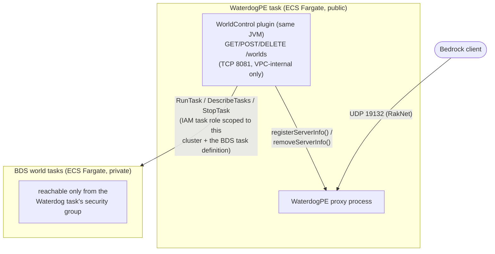
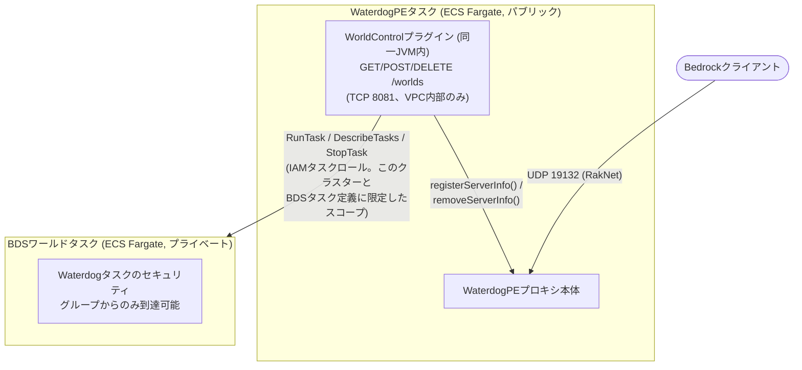

# BDS-waterdogpe

*[English](#english) / [日本語](#japanese)*

<a id="english"></a>
## English

A PMMP-style dynamic multi-world setup for vanilla Minecraft Bedrock
Dedicated Server (BDS), built on [WaterdogPE](https://github.com/WaterdogPE/WaterdogPE)
and AWS ECS Fargate. Players connect to a single WaterdogPE proxy; worlds
are provisioned/torn down on demand as separate BDS tasks, without ever
restarting the proxy.

### Why

BDS has no built-in concept of multiple loaded worlds or a plugin API -
each world is a separate server process. WaterdogPE fills the "multiple
worlds behind one address" role that a plugin-extensible server (like
PMMP) gets for free, and its plugin API can register/unregister
downstream servers at runtime. This repo wires that up to ECS Fargate so
a whole world - provisioning the task, waiting for it to become healthy,
registering it with the proxy - happens behind a single API call.

### Architecture



Nothing calls back into BDS: the Bedrock Dedicated Server binary has no
plugin system, so "add a world" can only ever be triggered from outside
it (the WorldControl API, or hakomc scripts calling that API from
inside a *different* running world - see below).

### Layout

- **`waterdog/`** - the WaterdogPE proxy image and the `WorldControl`
  plugin (Java/Gradle) that provisions worlds via the AWS SDK. See
  [`waterdog/config.yml`](waterdog/config.yml) for the proxy config and
  [`waterdog/plugin/src`](waterdog/plugin/src) for the plugin.
- **`infra/`** - AWS CDK (TypeScript) stack: VPC (public subnets only,
  no NAT Gateway - there's no load balancer or multi-instance HA in
  scope, so it isn't needed), security groups, the ECS cluster/task
  definitions, and the IAM policy that scopes WorldControl's AWS access
  to `RunTask`/`StopTask`/`DescribeTasks` on this cluster and
  `PassRole` on exactly the BDS task's two roles.
- **`hakomc/`** - a [hakomc](https://github.com/hakomc/hakomc) dev
  environment (Bedrock Scripting API), bootstrapped from
  [hakomc-server](https://github.com/hakomc/hakomc-server). Its
  `src/worldControl.ts` is a small client for the WorldControl API so a
  behavior pack running on *one* world can add or remove *other*
  worlds, using `@minecraft/server-net`'s HTTP client (the only way to
  make outbound HTTP calls from BDS-side scripts).

### Status

IaC and application code only - **nothing here has been deployed**.
`cdk synth` and both Gradle/npm builds are verified to succeed; see the
commit history for what was actually checked (built jar contents, the
synthesized IAM policy, clean-install builds, etc.) versus what's
still an assumption to confirm at deploy time.

Known rough edges, called out in code comments where they matter:

- `@minecraft/server-net` and `@minecraft/server-admin` are both
  pre-release Bedrock modules. The manifest dependency version string
  convention and the exact server-side `variables` config file/flag
  that `worldControl.ts` reads `worldControlApiUrl` from are both worth
  reconfirming against current Bedrock docs before relying on them.
- The WaterdogPE Fargate task has no load balancer, so its public IP
  changes if the task is ever replaced. There's no Elastic IP/Route53
  update wired up for that yet.
- BDS defaulting to the NetherNet transport (which WaterdogPE's RakNet
  downstream connection can't reach) is handled by passing
  `TRANSPORT=raknet` as a RunTask container override - itzg's image
  maps that into `server.properties` correctly as of
  [itzg/docker-minecraft-bedrock-server#675](https://github.com/itzg/docker-minecraft-bedrock-server/pull/675).

### Building

```bash
# WaterdogPE + plugin image (multi-stage: builds the plugin jar, then
# assembles the proxy image)
docker build -t waterdogpe ./waterdog

# CDK infra - type-checks and synthesizes CloudFormation templates,
# does not deploy anything
cd infra && npm install && npx cdk synth

# hakomc dev environment + WorldControl operations library
cd hakomc && npm install && npm run build
```

### License

Not yet decided for this repo's own code (`waterdog/`, `infra/`).
`hakomc/` carries its own GPLv3 license, inherited from the
[hakomc-server](https://github.com/hakomc/hakomc-server) template it
was bootstrapped from.

---

<a id="japanese"></a>
## 日本語

素のMinecraft Bedrock Dedicated Server(BDS)上で、PMMPのような動的マルチワールドを実現する仕組み。[WaterdogPE](https://github.com/WaterdogPE/WaterdogPE)とAWS ECS Fargateの上に構築している。プレイヤーは単一のWaterdogPEプロキシに接続し、ワールドは必要に応じて個別のBDSタスクとしてプロビジョニング/破棄される。プロキシを再起動する必要は一切ない。

### なぜこの構成か

BDSには複数ワールドを同時にロードする概念もプラグインAPIも無く、ワールドごとに完全に別のサーバープロセスになる。WaterdogPEは、PMMPのようなプラグイン拡張可能なサーバーが標準で持っている「1つのアドレスの裏に複数ワールド」という役割を肩代わりし、そのプラグインAPIで実行中にダウンストリームサーバーを登録・解除できる。このリポジトリでは、それをECS Fargateに接続し、「タスクをプロビジョニングし、ヘルスチェックが通るのを待ち、プロキシに登録する」という一連の作業をAPI呼び出し1回で完結させている。

### アーキテクチャ



BDS側からの呼び返しは一切無い。Bedrock Dedicated Serverバイナリにはプラグイン機構が無いため、「ワールドを追加する」というトリガーは常に外側(WorldControl API、またはhakomcのスクリプトが*別の*稼働中ワールドからそのAPIを呼ぶ形。後述)からしか発生し得ない。

### 構成

- **`waterdog/`** — WaterdogPEプロキシのイメージと、AWS SDK経由でワールドをプロビジョニングする`WorldControl`プラグイン(Java/Gradle)。プロキシ設定は[`waterdog/config.yml`](waterdog/config.yml)、プラグイン本体は[`waterdog/plugin/src`](waterdog/plugin/src)を参照。
- **`infra/`** — AWS CDK(TypeScript)スタック。VPC(パブリックサブネットのみ、NAT Gateway無し — ロードバランサや複数インスタンスによる高可用性はスコープ外なので不要)、セキュリティグループ、ECSクラスター/タスク定義、そしてWorldControlのAWS操作権限をこのクラスターへの`RunTask`/`StopTask`/`DescribeTasks`と、BDSタスクの2つのロールへの`PassRole`だけに絞ったIAMポリシー。
- **`hakomc/`** — [hakomc](https://github.com/hakomc/hakomc)(Bedrock Scripting API)の開発環境。[hakomc-server](https://github.com/hakomc/hakomc-server)からブートストラップ。`src/worldControl.ts`はWorldControl APIの小さなクライアントで、*あるワールド*上で動いているビヘイビアパックから、`@minecraft/server-net`のHTTPクライアント(BDS側スクリプトから外部HTTP呼び出しを行う唯一の手段)経由で*別のワールド*を追加・削除できる。

### 現状

IaCとアプリケーションコードのみ — **ここには何もデプロイされていない**。`cdk synth`とGradle/npm両方のビルドが成功することは確認済み。実際に何を確認したか(生成されたjarの中身、synthesizeされたIAMポリシー、クリーンインストールでのビルド等)と、デプロイ時にまだ確認が必要な仮定の部分は、コミット履歴を参照。

コードコメントに残している、既知の粗い部分:

- `@minecraft/server-net`と`@minecraft/server-admin`はどちらもプレリリース版のBedrockモジュール。manifestの依存バージョン文字列の慣習や、`worldControl.ts`が`worldControlApiUrl`を読み取っているサーバー側の`variables`設定ファイル/フラグの正確な仕様は、実デプロイ前に最新のBedrockドキュメントで再確認する価値がある。
- WaterdogPEのFargateタスクにロードバランサが無いため、タスクが置き換わるとパブリックIPが変わる。Elastic IPやRoute53の自動更新は未整備。
- BDSがデフォルトでNetherNetトランスポートになる問題(WaterdogPEのRakNetダウンストリーム接続が届かない)は、RunTaskのコンテナオーバーライドで`TRANSPORT=raknet`を渡すことで対処している。itzgのイメージは[itzg/docker-minecraft-bedrock-server#675](https://github.com/itzg/docker-minecraft-bedrock-server/pull/675)以降、これを正しく`server.properties`にマッピングしてくれる。

### ビルド

```bash
# WaterdogPE + プラグインのイメージ (マルチステージ: プラグインjarをビルドしてから
# プロキシイメージを組み立てる)
docker build -t waterdogpe ./waterdog

# CDKインフラ — 型チェックとCloudFormationテンプレートの生成のみ、
# デプロイは行わない
cd infra && npm install && npx cdk synth

# hakomc開発環境 + WorldControl操作ライブラリ
cd hakomc && npm install && npm run build
```

### ライセンス

このリポジトリ自体のコード(`waterdog/`、`infra/`)についてはまだ未決定。`hakomc/`は、ブートストラップ元の[hakomc-server](https://github.com/hakomc/hakomc-server)テンプレートから継承した独自のGPLv3ライセンスを持つ。
